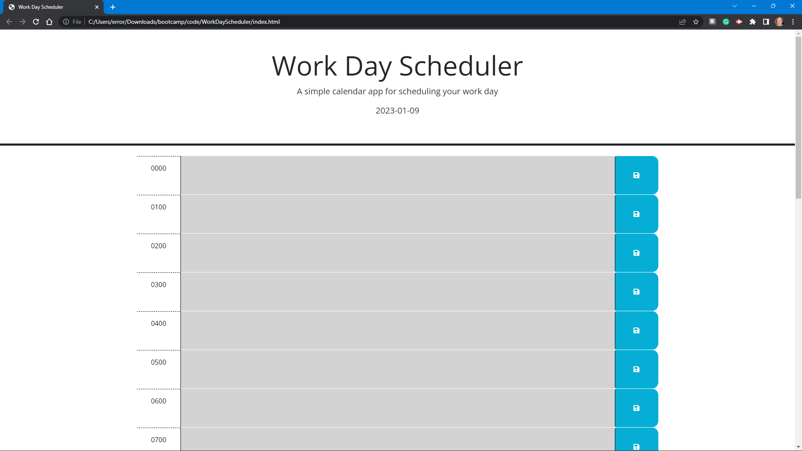

# WorkDayScheduler

## Description

The purpose of this project was to learn to use Bootstrap elements, JQuery elements, selectors, and methods as well as Day.js methods.

## Table of Contents (Optional)

- [Installation](#installation)
- [Usage](#usage)
- [Credits](#credits)
- [License](#license)

## Installation

To clone this repository, at the command prompt type:

```
git clone git@github.com:error201/WorkDayScheduler.git
```

## Usage

Visit [WorkDayScheduler.](https://error201.github.io/WorkDayScheduler/)
Simply click on the block of time you wish to schedule, enter the details, and click the save button.




## Credits

This project relied heavily on:
   - Bootstrap: https://www.getbootstrap.com
   - JQuery: https://www.jquery.com
   - Day.js: https://dayjs.org


## License

This repo is covered under the MIT license. Please read [MIT License](LICENSE) for details..

---

## Badges


## How to Contribute

Fell free to clone and/or fork this repository!